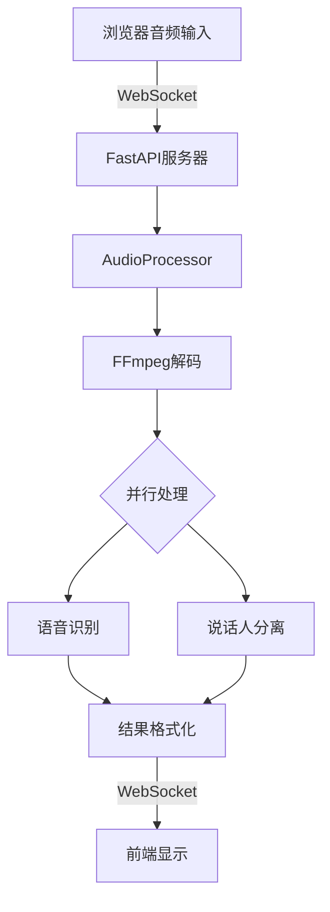
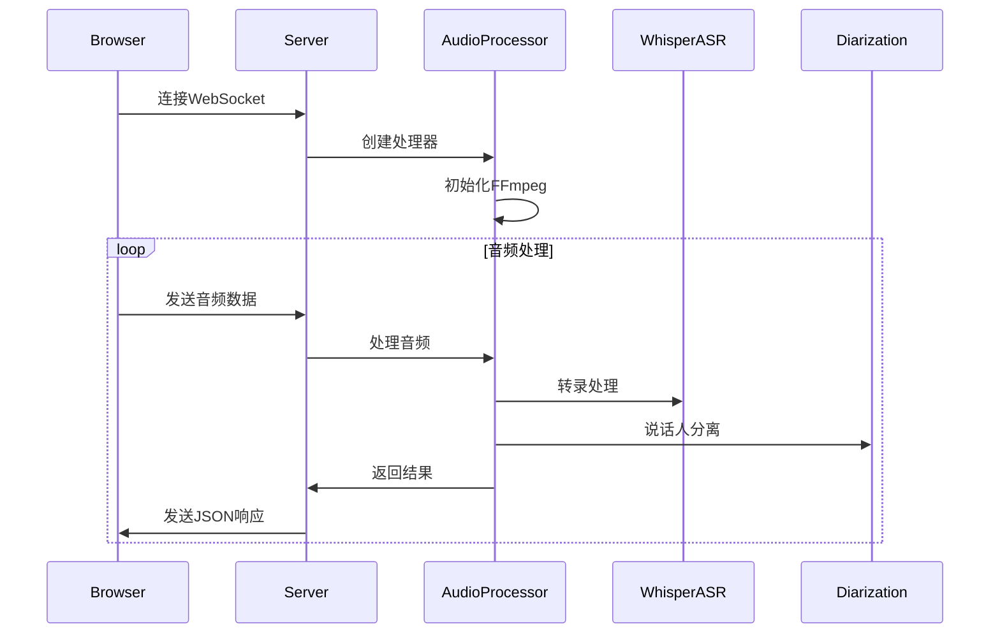

# WhisperLiveKit 执行流程分析

## 1. 服务器初始化

服务器启动时，首先初始化 FastAPI 应用并加载 WhisperLiveKit：

```python
# whisper_fastapi_online_server.py (Line 13-19)
kit = None

@asynccontextmanager
async def lifespan(app: FastAPI):
    global kit
    kit = WhisperLiveKit()
    yield
```

WhisperLiveKit 初始化过程中会加载模型和配置：

```python
# whisperlivekit/core.py (Line 165-189)
def __init__(self, **kwargs):
    if WhisperLiveKit._initialized:
        return
        
    default_args = vars(parse_args())
    merged_args = {**default_args, **kwargs}
    self.args = Namespace(**merged_args)
    
    self.asr = None
    self.tokenizer = None
    self.diarization = None
    
    if self.args.transcription:
        self.asr, self.tokenizer = backend_factory(self.args)
        warmup_asr(self.asr, self.args.warmup_file)

    if self.args.diarization:
        from whisperlivekit.diarization.diarization_online import DiartDiarization
        self.diarization = DiartDiarization()
```

## 2. WebSocket 连接建立

当客户端访问服务器时：

1. 首先获取 Web 界面：
```python
# whisper_fastapi_online_server.py (Line 31-33)
@app.get("/")
async def get():
    return HTMLResponse(kit.web_interface())
```

2. 建立 WebSocket 连接：
```python
# whisper_fastapi_online_server.py (Line 44-58)
@app.websocket("/asr")
async def websocket_endpoint(websocket: WebSocket):
    audio_processor = AudioProcessor()
    await websocket.accept()
    logger.info("WebSocket connection opened.")
            
    results_generator = await audio_processor.create_tasks()
    websocket_task = asyncio.create_task(handle_websocket_results(websocket, results_generator))
```

## 3. 音频处理流程

### 3.1 音频处理器初始化

AudioProcessor 初始化时设置关键参数：

```python
# whisperlivekit/audio_processor.py (Line 28-47)
def __init__(self):
    models = WhisperLiveKit()
    
    # 音频处理设置
    self.args = models.args
    self.sample_rate = 16000
    self.channels = 1
    self.samples_per_sec = int(self.sample_rate * self.args.min_chunk_size)
    self.bytes_per_sample = 2
    self.bytes_per_sec = self.samples_per_sec * self.bytes_per_sample
    self.max_bytes_per_sec = 32000 * 5  # 5秒音频 @ 32kHz
```

### 3.2 音频流处理

音频数据通过 FFmpeg 进行实时转换：

```python
# whisperlivekit/audio_processor.py (Line 59-64)
def start_ffmpeg_decoder(self):
    return (ffmpeg.input("pipe:0", format="webm")
            .output("pipe:1", format="s16le", acodec="pcm_s16le", 
                    ac=self.channels, ar=str(self.sample_rate))
            .run_async(pipe_stdin=True, pipe_stdout=True, pipe_stderr=True))
```

### 3.3 并行处理任务

创建并行任务处理音频流：

```python
# whisperlivekit/audio_processor.py (Line 385-395)
async def create_tasks(self):
    tasks = []    
    if self.args.transcription and self.online:
        tasks.append(asyncio.create_task(self.transcription_processor()))
        
    if self.args.diarization and self.diarization:
        tasks.append(asyncio.create_task(self.diarization_processor(self.diarization)))
    
    tasks.append(asyncio.create_task(self.ffmpeg_stdout_reader()))
    self.tasks = tasks
    
    return self.results_formatter()
```

## 4. 语音识别流程

### 4.1 后端初始化

根据配置选择并初始化适当的 Whisper 后端：

```python
# whisperlivekit/whisper_streaming_custom/whisper_online.py (Line 82-107)
def backend_factory(args):
    backend = args.backend
    if backend == "openai-api":
        asr = OpenaiApiASR(lan=args.lan)
    else:
        if backend == "faster-whisper":
            asr_cls = FasterWhisperASR
        elif backend == "mlx-whisper":
            asr_cls = MLXWhisper
        else:
            asr_cls = WhisperTimestampedASR

        asr = asr_cls(
            modelsize=args.model,
            lan=args.lan,
            cache_dir=args.model_cache_dir,
            model_dir=args.model_dir,
        )
```

### 4.2 转录处理

音频数据的实时转录处理：

```python
# whisperlivekit/audio_processor.py (Line 234-262)
async def transcription_processor(self):
    self.full_transcription = ""
    self.sep = self.online.asr.sep
    
    while True:
        try:
            pcm_array = await self.transcription_queue.get()
            
            # 处理转录
            self.online.insert_audio_chunk(pcm_array)
            new_tokens = self.online.process_iter()
            
            if new_tokens:
                self.full_transcription += self.sep.join([t.text for t in new_tokens])
                
            # 获取缓冲信息
            _buffer = self.online.get_buffer()
            buffer = _buffer.text
            end_buffer = _buffer.end if _buffer.end else (
                new_tokens[-1].end if new_tokens else 0
            )
```

## 5. 说话人分离（Diarization）

如果启用了说话人分离功能：

```python
# whisperlivekit/audio_processor.py (Line 264-288)
async def diarization_processor(self, diarization_obj):
    buffer_diarization = ""
    
    while True:
        try:
            pcm_array = await self.diarization_queue.get()
            
            # 处理说话人分离
            await diarization_obj.diarize(pcm_array)
            
            # 获取当前状态并更新说话人
            state = await self.get_current_state()
            new_end = diarization_obj.assign_speakers_to_tokens(
                state["end_attributed_speaker"], state["tokens"]
            )
```

## 6. 结果处理和返回

处理结果并通过 WebSocket 返回给客户端：

```python
# whisper_fastapi_online_server.py (Line 36-41)
async def handle_websocket_results(websocket, results_generator):
    try:
        async for response in results_generator:
            await websocket.send_json(response)
    except Exception as e:
        logger.warning(f"Error in WebSocket results handler: {e}")
```

## 数据流向图



## 关键流程时序图



这个执行流程展示了从客户端录音到最终显示结果的完整过程，包括音频处理、语音识别和说话人分离的并行处理机制。系统采用了异步处理和WebSocket实时通信，确保了实时性能和用户体验。
